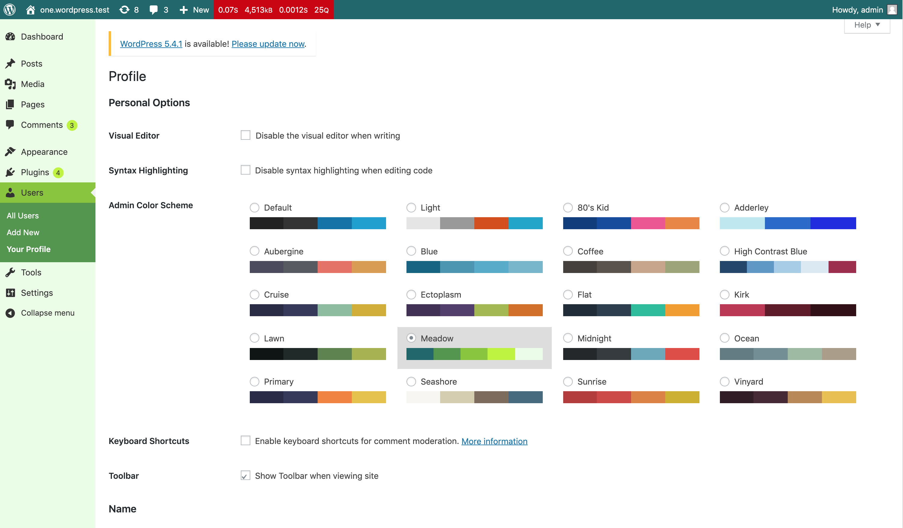

# kb-admin-color-scheme

This plugin is a test area to experiment with admin colors and core build processes. It has been released under GNU General Public License v3.0, however, it hasn't been developed for general use. 

Anybody is welcome to fork it and play around with it, however, the purpose of this plugin is for experimental development and therefore, may have breaking changes introduced at any time.

Please note, if you choose to use this plugin for any reason, no support is given.

---------

Base color scheme plugin structure taken from admin color schemes plugin created by the WordPress Core Team: http://wordpress.org/plugins/admin-color-schemes/

---------

#### Meadow: 
#1B676B -  #519548 - #88C425 - #BEF202 - #EAFDE6

Color Scheme originally created here: https://www.colourlovers.com/palette/871636/A_Dream_in_Color

---------

### TODO:

- [ ] Create colour palette of SASS variables and replace hex codes.
- [ ] Look at simplifying colour usage (removing the very specific chains of selectors currently in the plugin).
- [ ] Include correct PostCSS configuration.
- [ ] Look at implementing CSS Custom Properties.
- [ ] And probably loads more tasks still too :)